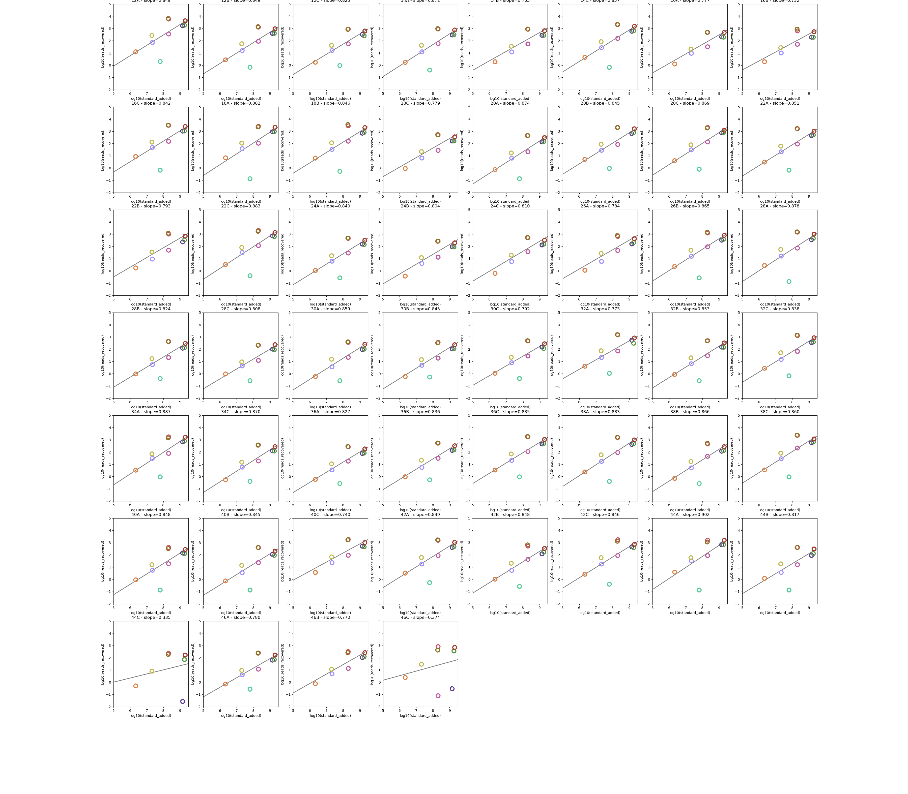
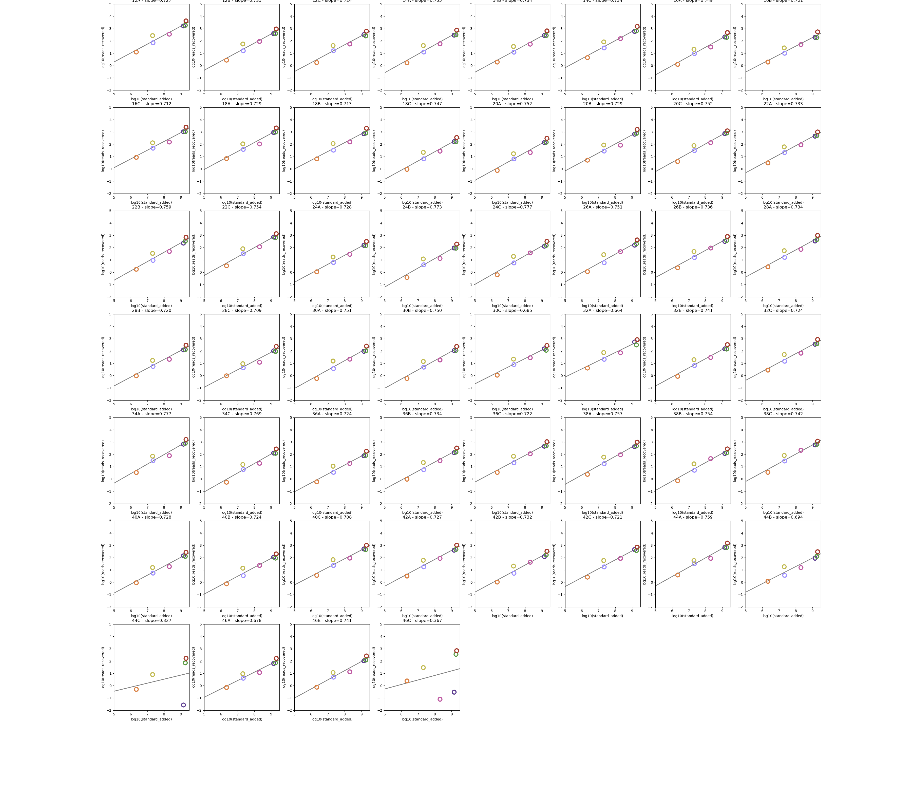

# RNAseq Pipeline with Internal Standard Correction 
RNAseq Pipeline with Read Count Correction using spike-in Internal Standards. 

## Example Output Figures:   
Examples before and after Internal Standard Filtering:  

  
  

## Setup
### 1. Install Snakemake and Conda/Mamba  
Install Snakemake and Conda/Mamba following the instructions at this [link](https://snakemake.readthedocs.io/en/stable/getting_started/installation.html#:~:text=for%20installing%20Snakemake.-,Installation%20via%20Conda/Mamba,-This%20is%20the). 

### 2. Set up Snakemake Pipeline
#### 2a. Create samples.tsv file: 
File containing metadata for raw read files. 
Required columns:
1. "sample" - Unique sample name 
2. "forward read" - Absolute path to forward reads .fastq file 
3. "reverse read" - Absolute path to reverse reads .fastq file

Optional: any additional columns with sample metadata. 

#### 2b. Create internal_standard_concentration.tsv file:
File containing data of internal standard added. 
Required columns:
1. "standard_name" - Unique name of internal standard added. 
    - **Important**: Column value should match with name of sequence in provided FASTA and GFF file
2. "standard_group" - Group that standard is in 
3. "concentration (ng/ul)" - Concentration of standard added 
4. "volume_added (ul)" - Volume of standard added 

#### 2c. Create cell_count.tsv file:
File containing cell count data for each sample. This will be used to calculate transcript per cell. 
Required columns:
1. "sample" - Unique sample name. Should match with "sample" column from samples.tsv	
2. "total_cell_count" - Count of cells in sample 

#### 2d. Edit config.yaml file:
File containing specifications for pipeline. 
1. Edit names (yaml keys) of reference genomes and their paths
2. Edit path to folder to store intermediate files: "scratch directory"
3. Edit length of sequenced read (from fastq file): "read length"
4. Edit minimum number of samples a standard has to be in: "minimum standard sample"

#### 2e. Edit profile/config.yaml file:
File containing HPC resource specifications. 
1. Edit partition name in "default-resources" - "partition"
2. Edit any other resources as needed 

#### 2f. Edit run_RNAseq_SM.sbatch file: 
File containing resource specification for main Snakemake run/command. 
1. Edit slurm SBATCH resource specifications as needed (e.g. time, partition)

## Running RNAseq Snamake Pipeline
1. Run pipeline by: `sbatch run_RNAseq_SM.sbatch`
    - Note: create logs/ folder before submitting job 
2. Check log files in logs/ folder 

## Workflow
- QC: low quality regions and adapters removed using bbduk.sh (BBtools)
- Read Mapping: mapped trimmed reads to reference genomes using bowtie2 with default parameters
- Read Counting: count reads mapped to each feature using HTSeq 
- Internal Standard Transcript Correction: details in section below 

### Internal Standard Transcript Correction
#### Obtain Efficiency from Internal Standards (IS)
1. Obtain count of **IS transcript molecules added** to each samples: 
    - Obtain molecular weight (mw) of each IS sequence: 
      - mw = mw_A + mw_U + mw_C + mw_C + constant
      - constant = 159
        - Note: this constant addition takes into account the M.W. of the 5' triphosphate
      - mw_A = number of A base in sequence * 329.2
      - mw_U = number of T base in sequence * 306.2
      - mw_C = number of C base in sequence * 305.2
      - mw_G = number of G base in sequence * 345.2
    - Calculate mass (g) from concentration and volume
      - concentration and volume values provided in internal_standard_concentration.tsv file in inputs/ directory 
    - Calculate number of molecule added from mass and molecular weight 
      - Moles added = mass / mw
      - Standard added = moles_added * 6.022x10^23 
2. Obtain count of **IS molecules recovered** (sequenced): 
    - Transcript count = (number of mapped reads * read length) / length of internal standard sequence 
    - Read length provided in inputs/config.yaml file 
3. Log10 both standards added and recovered 
4. Filter to remove outlier internal standards globally: 
    - Remove standards that are present in less than 10 samples 
    - Obtain median “log10 transcript recovered” for each standard across all samples 
    - Perform linear regression and remove standards that are above/below 3 standard error 
    - Plot global standard filtering 
5. Obtain slope and intercept of efficiency from the remaining standards for each sample locally 
    - For each sample, perform curve fitting and obtain slope and intercept for efficiency calculation
    - Plot local standard filtering 
#### Obtain Absolute Transcript Count per Cell Using Internal Standard Efficiency
1. Obtain number of transcript sequenced for each gene: 
    - Transcript count = (number of mapped reads * read length) / gene length 
2. Using the slope and intercept of Efficiency obtained from internal standards, calculate absolute transcript count: 
    - x = 10**((log10(y)-b)/m)
      - x = absolute transcript 
      - y = transcript sequenced
4. Obtain number of transcript per cell by dividing by sample cell count 

For more explanation, visit this [.PDF file](workflow/images/RNAseq_Internal_Standard.pdf)